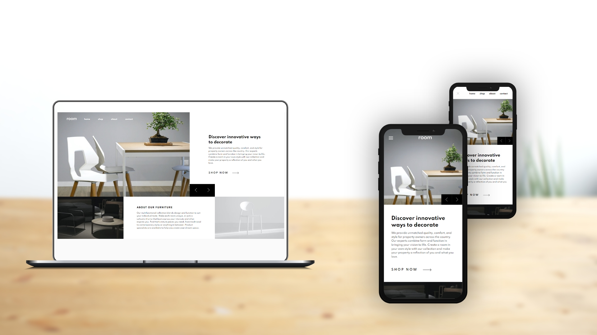

# Room homepage

This is a solution to the [Room homepage challenge on Frontend Mentor](https://www.frontendmentor.io/challenges/room-homepage-BtdBY_ENq). Frontend Mentor challenges help you improve your coding skills by building realistic projects. 

## Table of contents

- [Frontend Mentor - Room homepage solution](#frontend-mentor---room-homepage-solution)
  - [Table of contents](#table-of-contents)
  - [Overview](#overview)
    - [The challenge](#the-challenge)
    - [Screenshot](#screenshot)
    - [Links](#links)
  - [Front-end Style Guide](#front-end-style-guide)
    - [Layout](#layout)
    - [Colors](#colors)
    - [Typography](#typography)
    - [Font](#font)
  - [My process](#my-process)
    - [Built with](#built-with)
  - [Author](#author)

**Note: Delete this note and update the table of contents based on what sections you keep.**

## Overview

### The challenge

Users should be able to:

- View the optimal layout for the site depending on their device's screen size
- See hover states for all interactive elements on the page
- Navigate the slider using either their mouse/trackpad or keyboard

### Screenshot

### Links

- Live Site URL: [https://benjaminvillatte.github.io/fem-room-homepage/](https://benjaminvillatte.github.io/fem-room-homepage/)

## Front-end Style Guide

### Layout

The designs were created to the following widths:

- Mobile: 375px
- Desktop: 1440px

### Colors

_Primary_

- Dark Gray: hsl(0, 0%, 63%)
- Black: hsl(0, 0%, 0%)
- White: hsl(0, 0%, 100%)
- Very Dark Gray: hsl(0, 0%, 27%)

### Typography

- Font size: 12px

### Font

- Family: [Spartan](https://fonts.google.com/specimen/Spartan)
- Weights: 500, 600, 700

## My process

### Built with

- Semantic HTML5 markup
- CSS custom properties
- Flexbox
- CSS Grid
- Mobile-first workflow
- Vitejs for development and build

## Author

- Website - [Benjamin VILLATTE](https://www.benjaminvillatte.fr)

